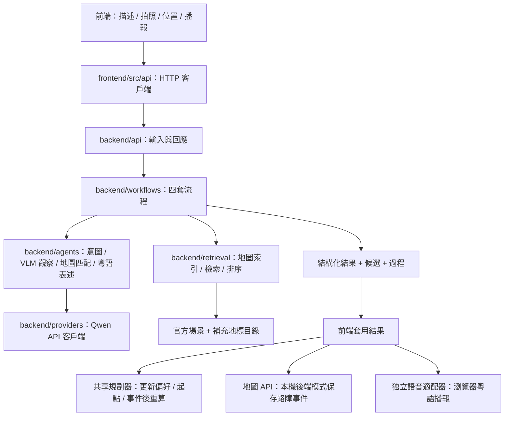

# 地圖與多 Agent 導航架構

四套 workflow 分別負責出行意圖、路障、定位和語音指引。模型觀察與地圖決策分開，所有定位和事件目標來自已載入的地圖。

## 四套流程

### 1. 用戶意圖

描述 → 意圖 agent → 出行偏好契約 → 用實際地圖預算路線 → 回傳結果 → 前端套用偏好並重新規劃。

未提及的偏好沿用既有設定。沒有既有設定時使用目前出行類型及明確的初始值。模型輸出只決定偏好，規劃器決定可行路線。

### 2. 路障

照片 → VLM 觀察 agent → 路障種類、公告原文、設施標誌和原始置信度 → 依位置與樓層檢索設施或路段 → 地圖匹配 agent → 排序與候選決策 → 地圖事件提案 → 套用後改道。

- `broken_lift` 搜尋真實 lift facility，其他路障搜尋附近 edge。
- 事件使用穩定的目標 ID，重報同一目標會更新事件，預設有效兩小時。
- 未看到障礙只表示本張照片未提供障礙證據，不自動解除舊事件。解除仍用原來的「恢復服務」。
- 事件 overlay 保留原始圖。靜態模式更新當前頁面；本機後端模式另以 `POST /api/events` 保存。

### 3. 視覺輔助定位

照片 → VLM 觀察 agent → 店名 / OCR / 樓層 / 物件外觀 → 地圖檢索 → 地圖匹配 agent → 排序 → 明確位置或候選列表 → 套用已匹配的 graph node → 從新起點重算。

第一個 agent 不接收候選答案，專注觀察畫面。第二個 agent 只接收觀察和檢索出的地圖紀錄，不接收圖片，也不產生新的地圖 ID。

有清楚店名時使用名稱及 OCR 匹配；店名模糊時使用補充地標的外觀描述、類別和文字片段。這是以地圖為語料的 retrieval-augmented matching：樓層 / 空間檢索、字元 bigram 排序和語意證據比較，當前資料量無需向量資料庫。

搜尋條件：

- 照片可見樓層或使用者選定樓層優先；兩者衝突時回傳無匹配。
- 有 GPS 時，以 GPS 為中心，半徑 `max(60m, 2 × accuracy_m)`。
- 沒有 GPS 時，以目前導航 graph node 為中心，半徑 120m；這只是搜尋先驗，不能獨自成為定位證據。
- 候選與目前剩餘路線距離只提供少量排序權重。未確認樓層时可保留跨層候選。
- 地標對應附近公開通道 graph node，表示地標附近的粗略位置。官方 GeoJSON 只在同層 20m 內附接通道節點。
- 室外已匹配地標可附接室外 graph node；舊的 GPS-only 結果契約仍保持相容。

### 4. 語音指引

後端重算的目前路段 → 確定距離 / 樓層 / 設施 / 下一步行動 → 指引 agent 轉成粵語短句 → speech provider → 前端套用與播報。

目前使用瀏覽器 SpeechSynthesis。API 回傳文字與 `speech` 播報計畫；前端語音適配器執行播報。`text_only` 不播放。已預留 `SpeechProvider` 接口，可另接產生 `audio_url` 的 TTS 服務，無需改寫 workflow。

瀏覽器需要裝置提供 `zh-HK` 或 `yue` 語音。沒有粵語語音時顯示原因並保留文字，不換成其他語言。性別選項依裝置語音名稱選擇；若無指定性別聲線，使用可用的粵語聲線。

## 匹配分數與候選確認

`score = min(VLM 原始置信度, 0.70 × identity + 0.15 × evidence + 0.10 × spatial + 0.05 × route)`

- `identity`：名稱 / OCR 的標準化 bigram 相似度，或可核對外觀描述相似度 × 0.85。
- 普通「走廊」「電梯」「樓梯」等名稱的 identity 權重下降，不當作唯一地標。
- `evidence`：第二個 agent 引用的 observed / mapped 片段均存在於照片觀察和候選資料時為 1，否則為 0。
- `spatial = max(0, 1 − distance_m / 120)`。
- `route = max(0, 1 − route_distance_m / 50)`，只比較相同樓層的路線節點。
- 路障分數另受路障觀察的置信度限制。

分數是可解釋的匹配分數，尚未用實景標註集校準成機率。最高分至少 0.8，且比下一個不同位置 / 設施高至少 0.12，才回傳 `ready`；0.2 以上但未滿足條件回傳 `needs_confirmation`；其餘為 `no_match`。

同一設施跨層紀錄在路障決策中視為同一目標。同一 node 上的重複地標在粗略定位中視為同一位置。

候選確認保存五分鐘，只使用本次已檢索的候選。確認使用原始分數，並標記 `match_method=user_confirmed`，不把低分改成高分。候選套用前仍檢查目前導航上下文與實際地圖 ID。

## 模組責任

| 目錄                                         | 職責                                        |
| -------------------------------------------- | ------------------------------------------- |
| `shared/genai`                               | 前後端共用輸入、結果、候選與上下文契約      |
| `backend/providers`                          | 外部 API 傳輸與語音適配；無提示詞或導航決策 |
| `backend/agents`                             | 單一角色的提示詞、觀察與表述；無 HTTP 路由  |
| `backend/retrieval`                          | 地圖索引、空間檢索、文字相似度、證據分數    |
| `backend/workflows`                          | 組合 agent、檢索與地圖結果，管理候選確認    |
| `backend/api`                                | HTTP 輸入、路由和回應；無模型提示詞         |
| `backend/repositories`                       | 場景、補充地標和事件讀寫                    |
| `frontend/src/api`                           | HTTP 呼叫；無 workflow 決策                 |
| `frontend/src/components/AgentWorkflows.tsx` | 輸入、候選展示、確認、結果套用              |
| `frontend/src/genai/speech.ts`               | 裝置語音播放                                |
| `services/accessroute_api.py`                | Python HTTP 客戶端                          |
| `services/accessroute_agents.py`             | Python CLI，使用同一套後端 workflow         |

輸入在 HTTP 和模型結果邊界驗證一次。核心流程使用已解析的型別；錯誤集中交給 HTTP 層。沒有虛構結果、強制提高置信度、默默吞錯或用另一模型自動兜底。

## 地圖資料現況

官方資料具有大量一般設施名稱，但缺少完整品牌店名和外觀描述。`data/landmarks/*.json` 目前為空目錄，供現場核對或商場資料補充；測試中的咖啡店和粉紅色招牌只存在於測試 fixture，不加入正式地圖。

新增地標格式和 API 使用方式見 [接入手冊](genai-integration.md)。
