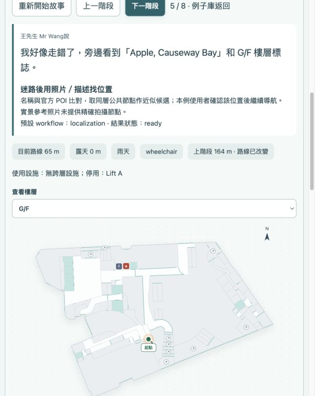

# 離線例子演示驗證

2026-10-04 驗證：48 個故事，388 個階段，496 條知識記錄，14 張有授權的實景歷史照片，388 張地圖視圖及 48 張演示故障告示。

- `npm run check`：67 項測試通過，TypeScript 與前端構建通過。
- 自動重放所有故事的所有 agent 結果，與每階段實際重新求路的快照一致。
- 48 個故事展示無台階規劃，44 個故事在雨天改用有蓋情境線；九龍塘保留有蓋原線。
- 跨樓層幾何分段已修復原地修改問題，反覆求路不會污染原始邊的 geometry。
- 在 `http://127.0.0.1:8788/?demo=1` 的純靜態服务上，通過 UI 依次播放王先生故事到完成到達；服務未建立模型 provider 或 workflow service。
- 靜態服務 `/__demo/status` 回應 `{ "backend": false, "api_requests": 0 }`。
- 最終頁面可展开定位的觀察、知識檢索、匹配確認和路由引擎輸入輸出；已核對 Apple 的正式店舖線索、G/F 候選和 65 米剩餘路線。
- 真实后端 `/api/knowledge/hysan-place?q=Apple` 返回官方來源名稱和 approximate / unmapped 狀態。

楼梯捷径、有蓋繞行與故障是明確標記的演示情境，沒有寫進原始正式場景。實景照片標示拍攝時間、來源、作者與授權；尚未標定精確拍攝節點。

