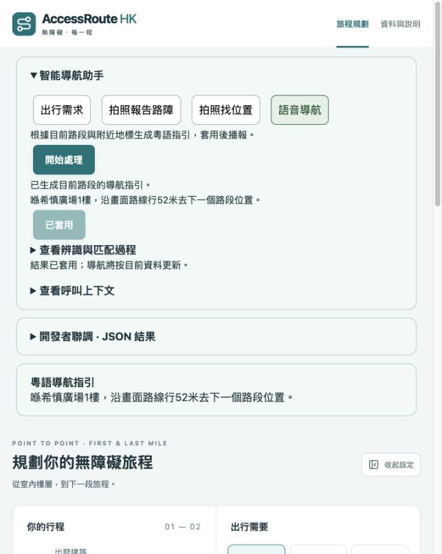

# Qwen 真實 API 聯調

測試日期：2026-10-04。服務端點由使用者提供。

後端本機 `.env` 配置：

```dotenv
DASHSCOPE_API_KEY=<本機密鑰>
QWEN_BASE_URL=https://maas.qianwenaiapi.com/compatible-mode/v1
QWEN_TEXT_MODEL=qwen3.8-max
QWEN_VISION_MODEL=qwen3-vl-plus
```

`.env` 已被 Git 忽略。密鑰只由後端讀取，不進入前端構建。

| 實際請求 | 結果 |
| --- | --- |
| 使用者提供的 solar energy 範例 | HTTP 200，三條英文要點，約 3.4 秒 |
| 同一端點 `/models` | HTTP 200，列出上述文字與視覺模型 |
| `/api/genai/workflows/preferences` | HTTP 200，手動輪椅、避樓梯、避陡坡、有蓋優先、文字提示；地圖重新規劃成功 |
| `/api/genai/workflows/guidance` | HTTP 200，產生目前路段的廣東話 JSON 指引 |
| `/api/genai/workflows/localization` | HTTP 200，依 `services/test1.jpeg` 觀察出夜景住宅、道路與海灣；與希慎廣場地圖無匹配，返回 `no_match` |
| `/api/genai/workflows/obstacle` | HTTP 200，照片無可見路障，無事件提案 |

真實模型的無路障回應可能帶空 `barrier.evidence`，已調整契約：無路障可以沒有證據文字，宣稱存在路障仍必須提供畫面證據。另明確限制指引 agent 的通行動作只能使用路線 action/facility，附近設施名稱只能作位置參照。

`npm run check`：58 項測試、TypeScript 檢查和前端構建通過。

在 `http://127.0.0.1:8787/` 頁面輸入輪椅需求，完成真實解析及套用；再生成並套用導航指引：「喺希慎廣場1樓，沿畫面路線行52米去下一個路段位置。」已確認修正後沒有將附近扶手電梯加入通行動作。



上述夜景照片驗證了視覺呼叫和無匹配流程；未用它驗證店名精準定位或真實路障改道。語音目前使用瀏覽器廣東話語音服務，本次真實聯調採文字模式，未驗證揚聲器播放。
